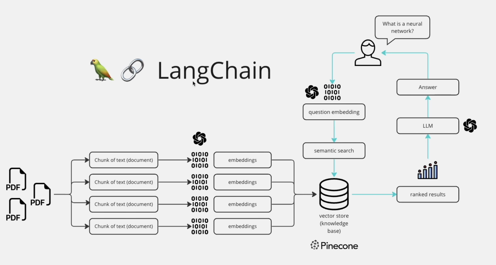

# Chat with Multiple PDFs

A LLM chat bot built to run locally on your machine with the capability to answer questions from your own pdfs. 

## Deployment

1. Create a virtual environment with Python >= 3.10

2. Install dependencies
```
pip install -r requirements.txt
```

3. Place HuggingFace Key in .env

   a. Create a key from https://huggingface.co/settings/tokens

   b. In a new file '.env' add HUGGINGFACEHUB_API_TOKEN=<token>

4. Run application
```
streamlit run app.py
```

You can now view your Streamlit app in your browser at http://localhost:8502

## Architecture



## Reference

This is my first project with LLMs and Langchain. Wanted to start with something basic. Followed the tutorial from: https://www.youtube.com/watch?v=dXxQ0LR-3Hg&t=2898s

## Deep Dive Articles
